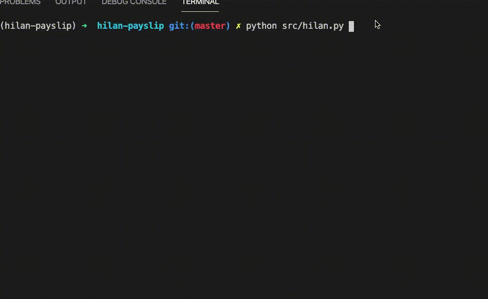

# Hilan Payslip


Download your Hilan payslip from CLI.

Bonus: The script will compare the salary to the previous month and will alert if there is a large gap between the two months.


## Demo


## Usage

Run ```./hilan``` to download the last month's payslip

Run ```./hilan <int>``` to donwload older months. For example ```./hilan 3``` will download the payslip for 3 months ago.

Run ```./hilan -p``` to mask salary numbers that are printed to the console.


## Install

Choose one of the two methods below:


### Binary for MacOS
1. Download the [latest release](https://github.com/talsalmona/hilan/releases/latest)
2. Rename conf-example.yaml to conf.yaml and fill in your credential and other settings.
3. Run ``` ./hilan ```

* You may need to go to the "Security & Privacy" settings on your mac and allow the app to run. This is usually a one time step.
* You may need to ``` chmod +x ``` the executable before running.


### From Source
1. Install python 3.6+ and pip
2. Clone this repo
3. Optionally, create a virtualenv
4. Install the depenencies
``` pip install -r requirements.txt ```
5. Rename conf-example.yaml to conf.yaml and fill in your credential and other settings.
6. Run
``` python src/hilan.py ```
